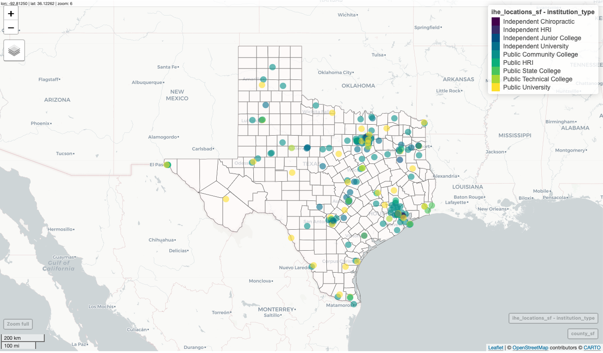

```{r setup, include=FALSE}
knitr::opts_chunk$set(echo = TRUE)
```

## What is this repository?

An Rmarkdown notebook, published using [Distill](https://pkgs.rstudio.com/distill/), that geocodes addresses for [Texas Institutions of Higher Education](http://www.collegeforalltexans.com/index.cfm?ObjectID=D57D0AC5-AB2D-EFB0-FC201080B528442A&CFID=119031819&CFTOKEN=89456070) in Texas by their reported address and overlays them on a map of Texas Counties. 
]

**Note**: To rerun this notebook in its entirety, a [Google Maps API Key](https://developers.google.com/maps/documentation/geocoding/get-api-key) is required for refreshing the geodcoded addresses provided for each IHE. Use that in place of "GOOGLE_MAPS_KEY" inside the `register_google()` function in the Rmarkdown document.

